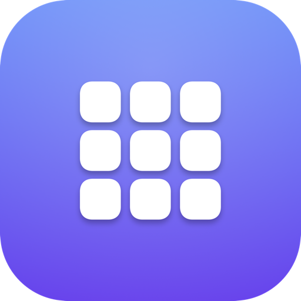
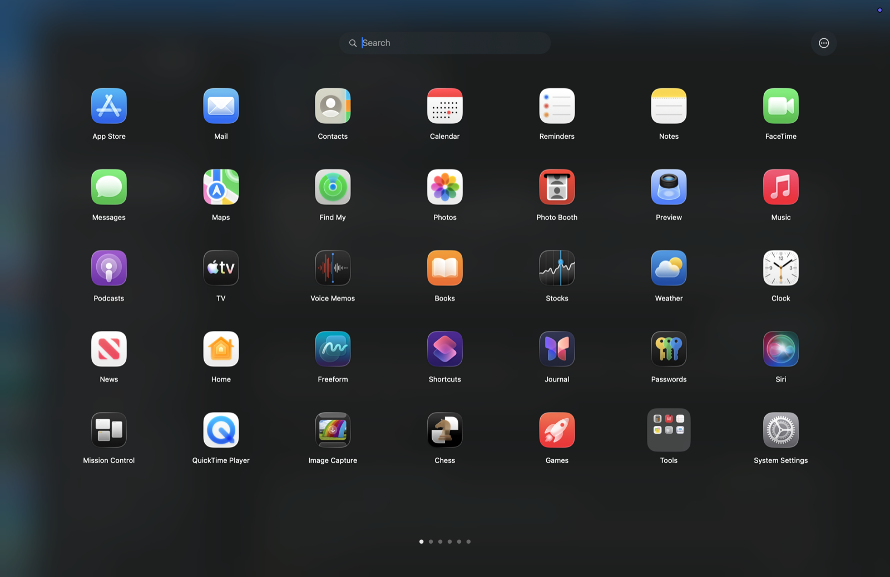

<div align="center">



# Relaunch

**The classic macOS Launchpad, back.**

A native, lightweight recreation of the full-screen Launchpad that macOS 26 (Tahoe) took away — frosted-glass background, paged icon grid, folders, and type-to-search.

[](https://github.com/JakeLaoyu/relaunch/releases/latest)
[](https://github.com/JakeLaoyu/relaunch/releases)
[](#requirements)
[](LICENSE)

[Download](https://github.com/JakeLaoyu/relaunch/releases/latest) · [Features](#features) · [Build from source](#build-from-source) · [How it works](#how-it-works) · [中文说明](README.zh-CN.md)



</div>

---

## Why

macOS 26 replaced the classic full-screen Launchpad with a Spotlight-style "Apps" view. If you miss the old one — the dark blur, the 7×5 grid, the folders, the pinch gesture — Relaunch brings it back as a small native app. No Electron, no background daemons, no special permissions.

## Features

- **Classic Launchpad UI** — full-screen dark frosted glass, 7×5 paged grid, paging dots, search field on top. Covers the Dock and menu bar, just like the original.
- **Five ways to open it**
  - **Trackpad pinch** — thumb + three fingers, the classic gesture (spread to close). Works via raw multitouch data; no Accessibility permission needed.
  - **Global hotkey** — `⌃⌥L` (Control–Option–L).
  - **Dock icon** — click it to open (the icon can be hidden in Settings).
  - **Menu-bar icon** — click to open, with a menu for Settings / import / quit.
  - **Launch at login** — via `SMAppService`.
- **Type-to-search** — just start typing. `←`/`→` to flip pages, `Return` opens the first hit, `Esc` closes.
- **Folders & drag-to-organize**
  - Drop an icon **onto the middle** of another to create a folder (drop **beside** it to reorder).
  - Click a folder to open the overlay; rename inline, drag to reorder, right-click to remove apps.
  - Drag an icon to the **left/right screen edge** to flip pages mid-drag.
  - Folders with fewer than two apps dissolve automatically.
- **Imports your old Launchpad layout** — on first run, Relaunch reads the classic Launchpad database and restores your page order and folders. You can re-import any time from the menu or Settings.
- **Stays out of your way** — your layout lives in `~/Library/Application Support/Relaunch/layout.json`; newly installed apps are appended automatically, uninstalled ones are dropped.
- **Localized** — English, Deutsch, Español, Français, 日本語, 한국어, 简体中文, 繁體中文.
- **Native & universal** — Swift + AppKit + SwiftUI, a single universal binary for Apple Silicon and Intel.

## Install

### Download (recommended)

Grab the latest DMG from the [Releases page](https://github.com/JakeLaoyu/relaunch/releases/latest), open it, and drag **Relaunch** to **Applications**. Builds are Developer ID-signed and notarized, so Gatekeeper is happy out of the box.

### Requirements

- macOS 14.0 (Sonoma) or later, Apple Silicon or Intel.

## Build from source

You only need the Xcode Command Line Tools — there is no Xcode project. `build.sh` compiles a universal binary with `swiftc` and assembles the `.app` bundle:

```bash
git clone https://github.com/JakeLaoyu/relaunch.git
cd relaunch
./build.sh                          # -> build/Relaunch.app (ad-hoc signed)
cp -R build/Relaunch.app /Applications/
open /Applications/Relaunch.app
```

Installing into `/Applications` is recommended so login-item registration is stable and Spotlight indexes the app. Local builds are ad-hoc signed; if Gatekeeper complains, allow the app under **System Settings → Privacy & Security**, or sign with your own identity:

```bash
CODESIGN_IDENTITY="Developer ID Application: … (TEAMID)" ./build.sh
```

`Package.swift` exists for IDE support (`swift build` compiles the sources but does not produce a runnable `.app` bundle).

## How it works

| Piece | Approach |
|---|---|
| Overlay window | Borderless `NSWindow` at shielding level, so it covers the Dock and menu bar like the real Launchpad |
| Grid UI | SwiftUI with `.scrollTargetBehavior(.paging)`, drag & drop, folder overlay |
| Pinch gesture | The private `MultitouchSupport.framework`, loaded at runtime with `dlopen` — the same mechanism tools like BetterTouchTool use. No Accessibility permission required |
| Global hotkey | Carbon `RegisterEventHotKey` — system-wide, no permissions |
| Legacy import | Reads the classic Launchpad SQLite database (`com.apple.dock.launchpad/db`) and matches apps by bundle ID |
| App discovery | Scans `/Applications`, `/System/Applications`, and `~/Applications` |

```
Sources/Relaunch/
  main.swift                 Entry point (plain AppKit lifecycle)
  AppDelegate.swift          Coordinator: windows, menu bar, gesture, hotkey, settings
  AppScanner.swift           Finds installed apps
  LaunchpadModel.swift       Layout state, search, drag ops, JSON persistence
  LaunchpadView.swift        SwiftUI grid, folders, drag & drop
  LaunchpadController.swift  Full-screen overlay window
  StatusBarController.swift  Menu-bar item & menu
  SettingsView.swift         Settings window (SwiftUI)
  HotkeyManager.swift        Carbon global hotkey
  MultitouchGesture.swift    Trackpad pinch detection
  LaunchpadImporter.swift    Classic Launchpad layout import
  LoginItem.swift            Launch at login (SMAppService)
```

### A note on the private framework

The pinch gesture relies on `MultitouchSupport.framework`, which is private API. It has been stable for many years across macOS releases, but a future major update could require adjustments. Everything else — hotkey, Dock, menu bar — uses public API and keeps working regardless. The gesture can be disabled in Settings.

## Contributing

Issues and pull requests are welcome — bug reports, feature ideas, and new localizations especially. To add a language, copy `Resources/en.lproj/Localizable.strings` to a new `<locale>.lproj` folder and translate the values.

See [docs/DEVELOPMENT.md](docs/DEVELOPMENT.md) for the build/test loop, architecture map, and subsystem gotchas.

## License

[MIT](LICENSE)
